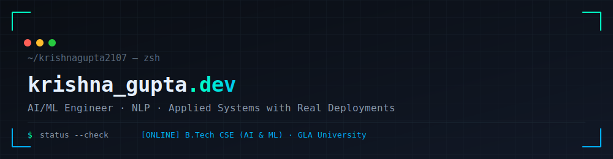

<div align="center">



<br><br>


</div>

<br>

```bash
[SYSTEM]  Booting profile...
[FOCUS]   AI/ML · NLP · Applied Systems with Real Deployments
[CGPA]    8.38 / 10
```

---

## 👋 About Me

CSE undergraduate (AI & ML) focused on shipping applied NLP and machine learning systems end-to-end — not just notebooks, but deployed, working products with real users hitting real endpoints.

I care more about a skill being backed by a shipped project than listed on a resume — every "shipped" tag below has a live deployment behind it.

---

## 🔭 Currently Exploring

- **NLP-driven applied systems** — semantic matching, compliance auditing, cross-lingual sentiment analysis
- **Multimodal deep learning** — combining text + other modalities (DRISHTI)
- **Personal AI agents** — voice interaction, vector memory, agent architecture (J.A.R.V.I.S)
- **LLM integration patterns** — using Gemini/OpenAI as an augmentation layer on top of classical NLP, not a replacement for it

---

### `> active_projects`

| Project | Stack | Status |
|---|---|---|
| **[RiskLens](https://github.com/krishnagupta2107/RiskLens)** — compliance & PII auditor (regex + spaCy NER, optional LLM summaries) | Flask, spaCy, Docker | 🟢 Live |
| **[AI Resume & Job Matching System](https://github.com/krishnagupta2107/MiniProject_4thSem)** — dual-engine (TF-IDF + spaCy + Gemini) candidate matcher, blind hiring mode, P/R/F1 metrics | Flask, spaCy, Gemini, Firestore | 🟢 Live |
| **[Diabetes Prediction System](https://github.com/krishnagupta2107/diabetes_prediction)** — Logistic Regression risk classifier on the PIMA dataset ([live](https://diabetes-prediction-kozs.onrender.com/)) | Flask, Scikit-learn | 🟢 Live |
| **[DRISHTI](https://github.com/krishnagupta2107/DRISHTI)** — cross-lingual multimodal sentiment analysis (data pipeline built; model architecture not yet implemented) | PyTorch, HuggingFace Transformers | 🟡 Early stage |
| **[J.A.R.V.I.S](https://github.com/krishnagupta2107/Jarvis)** — personal AI agent: voice interaction, persistent memory, holographic HUD | Node.js, Express, MongoDB, React (frontend in progress), Gemini/Groq | 🟡 In dev |
| **[AssetFlow — Odoo Hackathon 2026](https://github.com/ansh-codr/Odoo-Hackathon-2026)** — enterprise asset & resource management ERP, team build ([live](https://odoo-hack-bc2bd.web.app/)) | React 19, TanStack Start/Router/Query, Tailwind, Radix UI, Firebase | 🟢 Live |

---

## ⚙️ Technical Skills

### Languages
**Shipped:**   

### AI / ML / NLP
**Shipped:**  
**Learning:**  

### Frontend
**Shipped:**  

### Backend & Databases
**Shipped:**     

### Systems & DevOps
**Shipped:** 
**Learning:** 

### Certifications
  

---

### `> contribution_graph.render()`

<div align="center">


</div>

---

<div align="center">

```
$ contact --init
```

📫 [kg434580@gmail.com](mailto:kg434580@gmail.com) · 🔗 [github.com/krishnagupta2107](https://github.com/krishnagupta2107)

</div>
