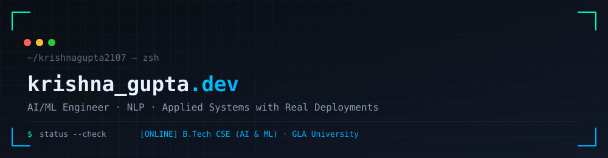

<div align="center">



<br><br>


</div>

<br>

```bash
[SYSTEM]  Booting profile...
[FOCUS]   AI/ML · NLP · Computer Vision · Full-Stack AI Apps
[CGPA]    8.38 / 10
```

---

## 👋 Professional Summary

**AI/ML Engineer** with a proven track record of designing, building, and deploying end-to-end machine learning systems. Specialized in NLP, Computer Vision, and Predictive Modeling, I bridge the gap between research and production by delivering scalable APIs, robust CI/CD pipelines, and intuitive user interfaces. Passionate about leveraging data-driven solutions to solve complex problems, backed by Microsoft Azure (AI-900 & AZ-900) and Google Cybersecurity certifications.

---

## 🔭 Education & Leadership

- **GLA University, Mathura** — B.Tech, Computer Science & Engineering (AI & Machine Learning)
  *Aug 2024 – Present | CGPA: 8.38/10*
- **Leadership:** Former Technical Head, Saturangle Club, GLA University — orchestrated technical initiatives, managed cross-functional events, and mentored engineering student teams.

---

### `> active_projects`

| Project | Stack | Status |
|---|---|---|
| **[AI Resume & Job Matching System](https://resumematcher-five.vercel.app/)** ([GitHub](https://github.com/krishnagupta2107/MiniProject_4thSem))<br>Architected a robust AI-driven recruitment platform using SpaCy NLP and Google Gemini AI. Automated resume parsing, candidate ranking, and implemented an unbiased blind-hiring workflow, drastically optimizing screening efficiency. | Python, Flask, SpaCy, Gemini AI, Firebase | 🟢 Live |
| **[Diabetes Prediction System](https://diabetes-prediction-one-theta.vercel.app/)** ([GitHub](https://github.com/krishnagupta2107/diabetes_prediction))<br>Engineered a high-accuracy risk assessment tool (83% acc) using a Random Forest classifier. Productionized the model via a robust Flask REST API and deployed a responsive web interface on Render for real-time predictions. | Python, Flask, Scikit-learn, Pandas | 🟢 Live |
| **[RiskLens](https://risk-lens-red.vercel.app/)** ([GitHub](https://github.com/krishnagupta2107/RiskLens))<br>Developed a scalable compliance and PII auditing engine leveraging Regex and SpaCy NER models, complemented by optional LLM-driven summaries. Containerized with Docker for seamless integration. | Flask, spaCy, Docker | 🟢 Live |
| **[AssetFlow — Odoo Hackathon 2026](https://odoo-hack-bc2bd.web.app/)** ([GitHub](https://github.com/ansh-codr/Odoo-Hackathon-2026))<br>Collaborated on an enterprise-grade asset and resource management ERP system. Built on a modern React 19 stack to deliver a highly performant and scalable organizational tool. | React 19, TanStack, Tailwind, Firebase | 🟢 Live |
| **[DRISHTI](https://github.com/krishnagupta2107/DRISHTI)**<br>Spearheading a multimodal sentiment analysis engine. Fusing vision models (ResNet50/ViT) with cross-lingual transformers (XLM-RoBERTa) to analyze ~19.6K multi-language text-image pairs. Integrated robust W&B experiment tracking. | PyTorch, HuggingFace, ResNet50 | 🟡 In dev |
| **[J.A.R.V.I.S](https://github.com/krishnagupta2107/Jarvis)**<br>Designing an advanced, voice-first intelligent agent featuring robust wake-word detection and custom DSP triggers. Integrating automatic failover between Gemini 2.0 and Groq Llama 3.3, enhanced by persistent vector memory. | MERN Stack, Gemini, Llama 3.3 | 🟡 In dev |

---

## ⚙️ Technical Capabilities

### Languages & Frameworks
   

### Machine Learning & AI
     

### Data Engineering & MLOps
     

### Web Integration & Cloud
       

### Certifications
  

---

### `> contribution_graph.render()`

<div align="center">


</div>

---

<div align="center">

```
$ contact --init
```

📫 [kg434580@gmail.com](mailto:kg434580@gmail.com) · 🔗 [github.com/krishnagupta2107](https://github.com/krishnagupta2107) · 💼 [LinkedIn](https://www.linkedin.com/in/kris-hnaa07) · 💻 [LeetCode](https://leetcode.com/u/kris_hnaa07/) · 🌐 [krishnagupta.xyz](https://krishnagupta.xyz)

</div>
